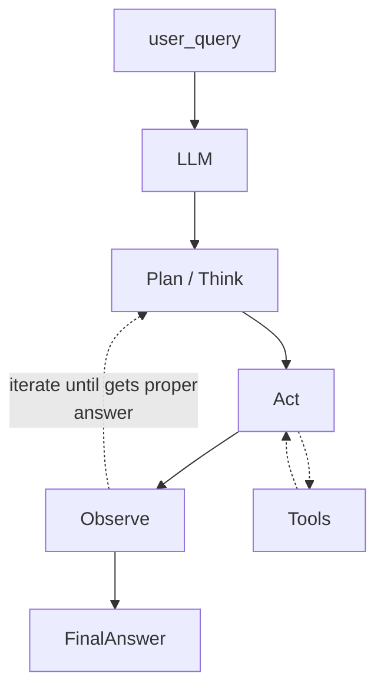

# Processes & their Automation
- With Clearly Defined Simple Rules
    - Coding
- With Some Rules or Complex Rules (often needs more time to figure out / requirements and logic constantly changing)
    - AI, Machine Learning
    - Why cannot we use same for where clear simple rules are these. (to skip the pain of automation line by line) Rule is make it simple straight-forward, accuracy (100% in coding, AI, ML not exact)
- Fully without rules
    - No Scope for now since manual intervention need everywhere


## Traditional Coding / Automation <!-- markmap: fold -->
- Clearly Set Rules 
- Input Data + Rules = Output Data

## AI / ML / Data Science <!-- markmap: foldAll -->
- More complex logic / probability based outputs
- Output Data + Input Data = Rules
- Requires Training with Historical Data and predits output from new inputs
    - Like experienced manager who selects new candidates
        - Seen lot of resumes/condidatees in the past
        - He is very good at identifying great candidates
        - Intuition (where unable to figure out exact way of logic. but we know the logic in our mind)
        - He might struggle when candidates a different pattern (not seen pattern in the past)
        - Once he sees multiple of such candidates, he puts them in experience and later he will be able to figureout similar candidates
    - Machine Learning Models are trained on historical data
        - trained on historical data and now able to predit from new inputs
        - if new patterns comes it needs to retrained.
        - Overfitting, underfitting issues
    - Output Data + Input Data --> figure out Rules
    - Once Rules are figured out, that experience is used to predit output from new inputs

# Machine Learning, Deep Learning, NLP Pretrained Models, LLMs
- Tradition Machine Learning needs structured data like tabular data
- But if data is unstructured, we go use deep learning methods
- Deep Learning techniques are used unstructured data like Image, Audio, Text Data
- But needs huge amount of data to be accurate. Need more resoucues to train and run (resources like GPU/TPU cores, RAM etc. )
- Although, we get enough Resources, what about data. It needs huge amount of data
- To train, deeplearning / NLP models, Need more data and resouces, thus expensive 
- There comes into input pretrained models. Which big companies train and made avaiable for us to use
- Recent Pretrained NLP models like LLMs (large language models) have made huge leap in AI
- Open AI's GP4-4 / Chat GPT, Google's Gemini, Facebook's LLaMa
- Human Like conversational AI
- LLMs - Large language models trained on huge amount of data
- Now we can use these LLM to deal with NLP based problems

# Generative AI (LLMs)
- Fine Tuning
    - Resouces intensive but more accurate result to tailor our needs
- Prompt Engineering - Hard Prompts by humans
    - The Task of developing prompts that guide an LLM peform specialized tasks
        - Eg: Translate English to Hindi
            Pen -> Kalam
            Lotus -> Kamal
            Mango -> 
          This should more accurately give `Aam` as output
        - In above example, we used prompt engineering to train a model to perform a specialized task with just a single prompt
    - Guiding the output of an LLM to help our specific needs
    - Give direct questions to LLMs (It will answer )
    - Give Context and ask questions (Give Context)
    - Give context, as questions and tell how to approach (Chain of thought + Constant correction of context)
- Prompt Tuning - Soft prompts crafted by AI - PEFT (parameter efficient fine tuning)
        - But if the task is more complex than this, it may require dozens of these prompts And so these handcrafted prompts  have begun to be replaced by AI designated prompts known as `soft prompts` 
        - `Soft prompts` have been shown to outperform human engineered prompts (`Hard prompts` like the above example)

        - Researches says: For Larger models, (especially at more than 11B scale parameter) Prompt tuning matches at the 10B model which is fully fine tuned. 
- Prefix Tuning: 
- Prompt Engeering: a way to Effectively communicate with LLMs
- Since Predominently trained on internet data, possibility of Halusination (False Answers). So need prompt engineering


- 4 Methods of Prompt Engeering 
    - RAG (Retrieval Augmented Generation)
        - LLM trained on internet data
        - Not aware your domain specific knowlege base content (specific to company)
        - So when you query to LLM, you want to bring awareness of your knowledge base

    ```mermaid
    flowchart LR
        question --> retriever --> LLM[[LLM]] --> answer
        retriever --> VectorDB[(Vector DB)]
        VectorDB --> retriever
    ```
    Let us take the example of a financial information for a company. If you were to directly ask a question through LLM about the total earnings of the company for a specific year, it is going to go through its learning and the internet data (on which it is trained) and come up with a number that may not be accurate. 
    - COT (Chain of Thought) - One of the few shot training technique
    LLM, like a 5 year old kid, also needs guidance to arrive at responses. COT is all about taking a bigger task of arriving at a response, breaking down into multiple sections and then combining the results of all those multiple sections and coming up with final answer. So instead of asking a LLM what is the total earnings of a company in 2022, ask for earning of company for software, hardware, and for consulting - Individual results to ultimately combine to final answer. Now LLM arrives at this answer by reasoning, through explainability 
    ```mermaid
    flowchart LR
    answer --> 5 --> 2 --> 3 --> output[Output = 5 + 2 + 3]
    ```
    - ReACT (Something like Few Shot Prompts - give multiple examples like in translation example earlier)
    ```mermaid
    flowchart TB
    prompt --> ReACT
    ReACT --> PUBKB --> ThoughtOfAction
    ReACT --> PRIVKB --> ThoughtOfAction
    ThoughtOfAction[Thought Action Observation] --> ReACT
    ```
    ReACT is also a few shot training technique. but different from `COT`(breaking down into steps to arrive at response), ReACT goes one step further not only reasoning with these steps, but acting based off what else is necessory to arrive the response. Similar to RAG, both use private database (content grounding), but in addition, ReACT goes thought the public information it is fed on and ablitity to go to public content to bring additional information to complete the task. 
    https://www.youtube.com/watch?v=1c9iyoVIwDs
    Thought 1 , thougth 2, thought 3 (combine) - Action 1, Action 2, Action3 --> observetion..
    - DSP (Directional Stimulous Prompting)
    Giving lanrge language model specific information from the task
    ask a question `What is annual earnings of a company` and tell LLM hint how approach like get for software, hardware and consulting and then arrive at things instead specifically asking 3 prompts then calcuating outputs. 

- AI Agents: Compound AI system design. Systems around the LLM to do magic
Recent Shift of focus from Monolythic Models to Compound AI systems
Models on their own are  limited by the data they have been trained on. So this impacts what they know about the world and what sort of tasks they can solve. 
Normal Models:
    - Limited Knowledge
    - Hard to adapt since it take an investment in Data and Resources 

Ask a questions Like How many vacation days I have left?
- Now when we ask this, LLM cannot answer this. We build a system around it in such way that LLM can answer this. 
- We give LLM the power to create query and fed to our database and get the results from db
- These results from db is again processed by LLM to construct and answer
- We should understand the principles of system design. Build a system around LLM - now it peforms much better
- System Design Modular element - we have choosing between models, choosing betwen extracting data (download from internet or from db or from some pdf etc. Programatic things also come into picture here). I can have output verifiers, I have programs to take query and break it down to increase the chances of answer being correct. I can combine that with searching database, with different tools like scrapers, 
When talking about system approaches, I can break down what I desire my program to do and pick the right components to be able to solve that.
This method is inherently easiler to solve more than tuning a model
- Modular, Faster and Quicker to adapt
- Control Logic of a progam 
    - Option1: Programatic control logic (Human design this)
    - Option2: Put the LLM in charge of control - This is only possible since we see tremendous improvement in the reasoning capability of large language models
    This Option2 is the Agetnic Aproach
- LLM AGENT: Capabilities 
    - **Reasoning** (Model capability)
    - **Act** (Tools - external pieces of the program). Model can define when to call those tools and how to call them in order to best execute the solution to the question they have been asked. 
        **Example of tools**:
            - Search Internet (scraper)
            - Search Database (database query function)
            - Search Documents (pdf reader and extractor)
            - Calculator (to do some math)
            - Piece of Program code to manipulate something 
            - Another LLM (may be a translational model)
            - APIs
            ...
    - **Access Memmory**: The tearm memory means like history of conversation, historical data while interacting with agents (with humans) 

- Way of Configuring Agents
    - 1. ReAct (**Reasoning** and **Act** as above saisd)
    
    - User Query --> LLM (Don't give the first thing that comes into your mind. but Think slow. Plan your work. and then Try to act. And when you are trying to **act**, you can define whether if you want to use external tools to help you come up with solution. Once you call a tool and you get an answer, may be it gave you a wrong answer, or came up with an error, you can **observe** that. So the LLM would observe the answer and would determine  if it does answer the question at hand, or whether it needs to iterate on the plan and determine to act differently, up until i get to a final answer)


The person defining the above system would examine what trade offs he/she wants in terms of autonomy in the system. For certain problems, narrow problems define narrow system simply programatic approch is better. But accomplish complex tasks, agentic approach- Human should be in the loop until we are fully sure.


### What is agentic RAG?
https://youtu.be/0z9_MhcYvcY?si=dxBP8V81M6YyVP0r


- LLM Use Cases
    - chat bots
    - Summarize
    - Information Retrieval

Any time, work with LLM first go with RAG approach (content grounding) [FIRST CATEGORY] and then take the approach of prompting it [SECOND CATEGORY which include other 3]

- Metrics
    - SuperGLUE Score


- Semantic Proximity

## Compound AI Systems
- Most popular is RAG


